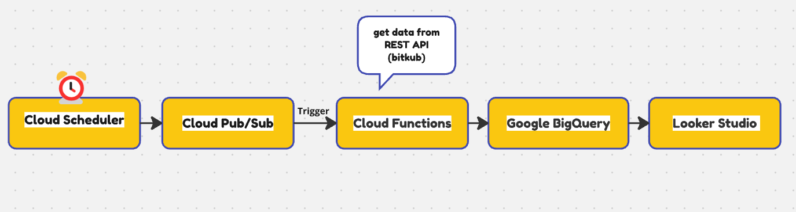

<h1> DataPipeline_doge-thb </h1> 

 

<h3> Create dataset and table in BigQuery </h3> 

  
  
  

<h3> Create Cloud Function </h3>

  
  
  

<h3> Create job in Cloud Scheduler </h3>

  
  

<h3> Check data in BigQuery and create view </h3>

  
  
  

<h3> Create dashboard from view </h3>

  

