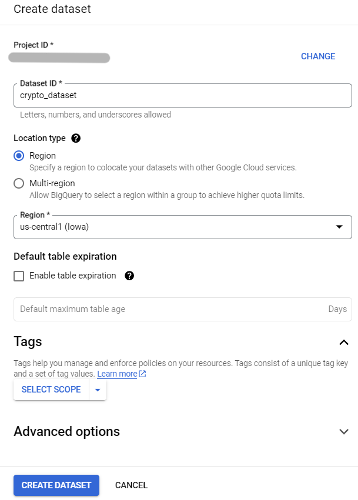

<h1> DataPipeline_doge-thb </h1> 

    
  data pipeline overview

<h3> 1) Create dataset and table in BigQuery </h3> 

   
    
    
  
 create the dataset and table successfully 

<h3> 2) Create a function in Cloud Functions </h3>

   
    
  
 set the trigger type is Cloud Pub/Sub, create the topic and then set up the environment variables 
  
   
  
 add code 

<h3> 3) Create job in Cloud Scheduler </h3>

  
    
  
 set the schedule to have Cloud Pub/Sub execute every 5 minutes 

<h3> 4) Check data in BigQuery and create view </h3>

    
  
 data has been successfully loaded into BigQuery 
  
   
  
 create view  
  
   
  
 create view successfully 

<h3> 5) Create a dashboard in BigQuery using a view as the data source </h3>

    
  
 DOGE_THB dashboard 🐶

  >>
  <a href="https://lookerstudio.google.com/reporting/7189bc3a-2d1a-4915-8011-08cbf65969a5"> LINK to Dashboard </a>
  ✌️

<h2> Reference </h2>

  <ul>
    <li> <a href="https://github.com/fonylew/simple-cloud-functions-to-bigquery"> https://github.com/fonylew/simple-cloud-functions-to-bigquery </a> </li>
    <li> <a href="https://github.com/bitkub/bitkub-official-api-docs"> https://github.com/bitkub/bitkub-official-api-docs </a> </li>
  </ul>

